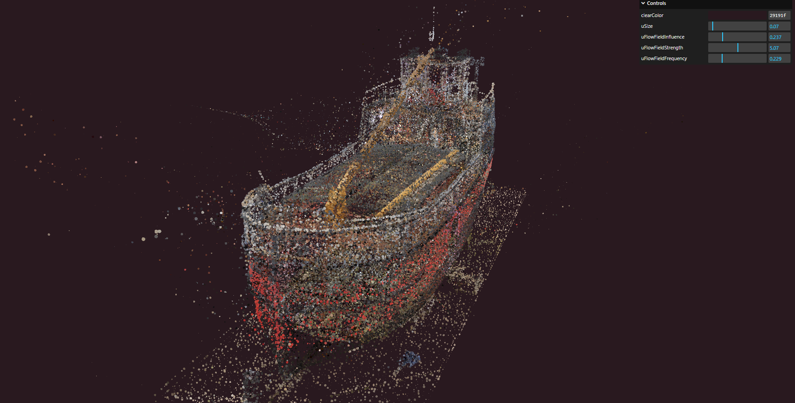

# Flow Field in ThreeJS
Flow field using gpgpu in threejs to move particles starting from a model of a boat.
My first particle system for 3D art. 




## Link
Click on this link to view the project in your browser
https://three-js-flow-field.vercel.app/

## Setup for local usage
Download [Node.js](https://nodejs.org/en/download/).
Run this followed commands:

``` bash
# Install dependencies (only the first time)
npm install

# Run the local server at localhost:8080
npm run dev

# Build for production in the dist/ directory
npm run build
```
